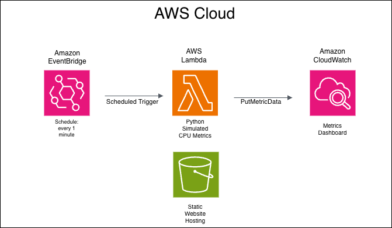

# 📊 CPU Monitoring Dashboard – AWS & Terraform

This project demonstrates an **Infrastructure as Code (IaC)** implementation that deploys a **simulated CPU monitoring dashboard** using **AWS serverless services**, fully automated with **Terraform**.

---

## 🧠 Project Overview

The system periodically generates simulated CPU usage metrics using an **AWS Lambda** function and publishes them to **Amazon CloudWatch**.  
These metrics are visualized in a **CloudWatch dashboard**, while a **static web page** is hosted on **Amazon S3**.

This project is designed for **learning and demonstration purposes**, focusing on cloud monitoring, serverless architecture, and Terraform-based deployments.

---

## 🗺️ Architecture



### Components

- **AWS Lambda**  
  Generates and publishes simulated CPU metrics.

- **Amazon EventBridge**  
  Triggers the Lambda function every 1 minute.

- **Amazon CloudWatch**  
  Stores metrics and displays them in a dashboard.

- **Amazon S3**  
  Hosts a static website.

- **Terraform**  
  Manages all AWS resources as Infrastructure as Code.

---

## 🚀 Deployment Instructions

### ✅ Prerequisites

- Terraform **>= 1.14**
- AWS account with configured credentials
- AWS CLI installed
- Python **3.12**

---

### 📦 Infrastructure Deployment

```bash
terraform init
terraform apply

